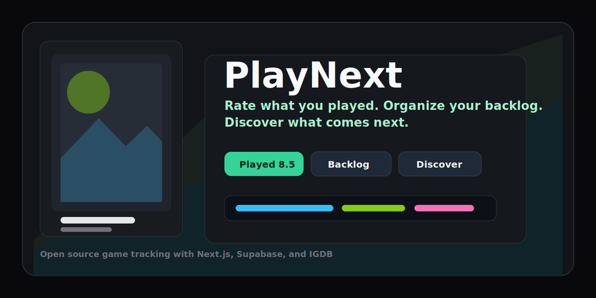

# PlayNext

[](https://github.com/AhmedSoliman10/playnext-game-tracker/actions/workflows/ci.yml)


**Rate what you played. Organize your backlog. Discover what comes next.**

**Live demo:** https://playnext-game-tracker.vercel.app

PlayNext is a conversational game-tracking web app for swipe-based discovery, ratings, reviews, personal libraries, statistics, and deterministic recommendations. It feels more like a friendly gaming assistant than a traditional database site.



## Why It Exists

Most game databases are great at storing information, but weak at helping players decide what to play next. PlayNext turns game tracking into a guided flow:

- answer whether you played, dropped, skipped, or want a game
- rate played games through a step-by-step conversation
- build clean personal lists automatically
- get recommendations based on your real taste signals
- search live IGDB metadata with artwork, screenshots, filters, and paging

## Highlights

- Swipe-based discovery cards with accessible button alternatives.
- Conversational rating flow with a required half-point overall rating and optional category ratings/review.
- Adaptive discovery queue that explores randomly at first, then ranks games using ratings, favorites, genres, platforms, and exclusions.
- Library pages for all games, played, currently playing, want to play, dropped, favorites, and played but not rated.
- Game details pages at `/games/[slug]` with cover art, screenshots, metadata, status controls, and rating controls.
- Search with IGDB-powered results, spelling-tolerant fallbacks, filters, sorting, URL sync, and 25-result pagination.
- Dashboard and profile statistics with lightweight CSS charts.
- Supabase Auth and PostgreSQL persistence with RLS policies.
- Seeded/demo provider so the app works even without external credentials.
- Vitest unit/integration coverage and Playwright end-to-end coverage.

## Tech Stack

- Next.js App Router, React, TypeScript strict mode
- Tailwind CSS and shadcn-style primitives
- Supabase Auth, Supabase PostgreSQL, `@supabase/ssr`
- IGDB via Twitch app credentials, with seeded fallback provider
- Zod and React Hook Form
- Lucide icons
- Vitest, React Testing Library, Playwright
- ESLint and Prettier

## Quick Start

```bash
npm install
cp .env.example .env.local
npm run dev
```

Open:

```text
http://localhost:8000
```

Without Supabase credentials, PlayNext runs in local demo mode. Demo mode stores a local session cookie and file-backed demo library data in `.playnext-data/`.

## Environment Variables

```env
NEXT_PUBLIC_SUPABASE_URL=
NEXT_PUBLIC_SUPABASE_ANON_KEY=
SUPABASE_SERVICE_ROLE_KEY=
IGDB_CLIENT_ID=
IGDB_CLIENT_SECRET=
NEXT_PUBLIC_APP_URL=http://localhost:8000
```

Never expose `SUPABASE_SERVICE_ROLE_KEY` or `IGDB_CLIENT_SECRET` to browser code. They are only used server-side.

## Supabase Setup

1. Create a Supabase project.
2. Copy the project URL into `NEXT_PUBLIC_SUPABASE_URL`.
3. Copy the anon public key into `NEXT_PUBLIC_SUPABASE_ANON_KEY`.
4. Copy the service role key into `SUPABASE_SERVICE_ROLE_KEY` for server-only metadata sync.
5. Set `NEXT_PUBLIC_APP_URL` to your local or deployed app URL.
6. In Supabase Auth URL settings, set the Site URL to your deployed app URL and add redirect URLs:
   - `http://localhost:8000/auth/callback`
   - `https://your-domain.example/auth/callback`
   - `https://your-domain.example/reset-password`

Password reset emails are sent to `/auth/callback?next=/reset-password`; the callback exchanges the Supabase code and then opens `/reset-password`.

## Database Migration

Run the migration in `supabase/migrations/202607180001_playnext_initial_schema.sql` using the Supabase SQL editor or CLI.

With Supabase CLI:

```bash
supabase link --project-ref your-project-ref
supabase db push
```

## Seed Data

Seed the demo catalog with:

```bash
supabase db reset
```

or run `supabase/seed.sql` in the SQL editor after applying the migration.

The app also has a built-in seeded provider, so local demo mode works before Supabase is configured.

## IGDB Setup

IGDB powers live catalog search, artwork, and metadata when credentials exist.

1. Create a Twitch Developer application.
2. Add the client ID and client secret to `.env.local`.
3. Restart the dev server.

```env
IGDB_CLIENT_ID=your_twitch_client_id
IGDB_CLIENT_SECRET=your_twitch_client_secret
```

Provider order is IGDB, then the seeded catalog. If credentials are missing or IGDB is unavailable, PlayNext falls back to seeded data.

## Commands

```bash
npm run dev
npm run typecheck
npm run lint
npm run test
npm run build
npm run test:e2e
npm run format
npm run format:check
```

Playwright uses port `3100` to avoid colliding with a local dev server on `8000`.

## Deployment

PlayNext supports normal Next.js Node deployments.

1. Configure the environment variables in your hosting provider.
2. Apply Supabase migrations and seed data.
3. Build with `npm run build`.
4. Start with `npm run start`, or deploy through a Next.js-compatible platform such as Vercel.

For a public demo, you can omit Supabase and IGDB credentials to run the seeded demo flow. For a production app, configure Supabase and IGDB.

Current public demo:

```text
https://playnext-game-tracker.vercel.app
```

## Security Model

- Supabase Auth handles password storage and sessions.
- Middleware protects signed-in routes.
- Browser mutations go through validated server endpoints.
- Zod validates auth forms, ratings, statuses, profile updates, search params, and IGDB responses.
- User-owned tables have RLS policies scoped to `auth.uid()`.
- Global game metadata is readable to authenticated users but has no browser insert/update/delete policies.
- Server-side mutation routes include simple in-memory rate limiting.
- `SUPABASE_SERVICE_ROLE_KEY` and `IGDB_CLIENT_SECRET` are never used in client components.

## Testing

Current meaningful coverage includes:

- recommendation scoring and exclusions
- rating validation
- status transitions
- statistics and gaming personality assignment
- IGDB response normalization
- library status/rating integration behavior
- critical Playwright journey for sign-in, discovery, rating, library, details, backlog, and keyboard-accessible discovery

## Contributing

Contributions are welcome. Start with:

- [CONTRIBUTING.md](CONTRIBUTING.md)
- [SECURITY.md](SECURITY.md)
- open issues labeled `good first issue`

Good first areas:

- more recommendation explanation templates
- improved empty states
- additional provider normalization tests
- accessibility review for mobile discovery
- profile statistics refinements

## Roadmap

- OAuth provider configuration.
- User-controlled discovery reset.
- Server-side pagination for very large Supabase libraries.
- Richer recommendation tuning controls.
- Optional AI-generated assistant copy behind a provider interface.
- Import/export of existing game lists.
- Public share pages for favorite games and yearly stats.

## Known Limitations

- Demo mode is for local development and stores library data in `.playnext-data/demo-store.json`.
- OAuth providers are not enabled by default.
- Recommendation templates are deterministic and do not call an AI API.
- Live IGDB metadata sync needs `SUPABASE_SERVICE_ROLE_KEY` if games are not already seeded in Supabase.

## License

MIT. See [LICENSE](LICENSE).
