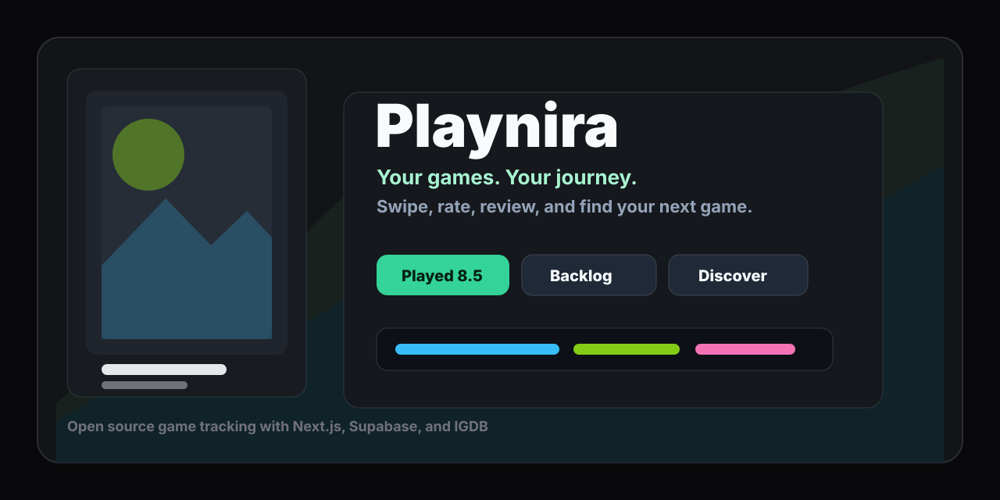

# PlayNext

[](https://github.com/AhmedSoliman10/playnext-game-tracker/actions/workflows/ci.yml)


**Rate what you played. Organize your backlog. Discover what comes next.**

**Live demo:** https://playnext-game-tracker.vercel.app

PlayNext is a conversational game-tracking web app for swipe-based discovery, ratings, reviews, personal libraries, statistics, and deterministic recommendations. It feels more like a friendly gaming assistant than a traditional database site.



## Why It Exists

Most game databases are great at storing information, but weak at helping players decide what to play next. PlayNext turns game tracking into a guided flow:

- answer whether you played, dropped, skipped, or want a game
- rate played games through a step-by-step conversation
- build clean personal lists automatically
- get recommendations based on your real taste signals
- search live IGDB metadata with artwork, screenshots, filters, and paging

## Highlights

- Swipe-based discovery cards with accessible button alternatives.
- Conversational rating flow with a required half-point overall rating and optional category ratings/review.
- Adaptive discovery queue that explores randomly at first, then ranks games using ratings, favorites, genres, platforms, and exclusions.
- Library pages for all games, played, currently playing, want to play, dropped, favorites, and played but not rated.
- Game details pages at `/games/[slug]` with cover art, screenshots, metadata, status controls, and rating controls.
- Search with IGDB-powered results, spelling-tolerant fallbacks, filters, sorting, URL sync, and 25-result pagination.
- Dashboard and profile statistics with lightweight CSS charts.
- Popular-right-now carousel and recommendation cards with feedback controls.
- Community profiles, follows, public activity, reactions, comments, report/block controls, and Discord profile linking.
- Rich public profiles with shelves, visible library sections, reviews, category ratings, and taste compatibility.
- CSV library import/export plus public Steam library import by profile URL or SteamID.
- Notification center and per-user notification preferences.
- Supabase Auth and PostgreSQL persistence with RLS policies.
- Seeded/demo provider so the app works even without external credentials.
- Vitest unit/integration coverage and Playwright end-to-end coverage.

## Tech Stack

- Next.js App Router, React, TypeScript strict mode
- Tailwind CSS and shadcn-style primitives
- Supabase Auth, Supabase PostgreSQL, `@supabase/ssr`
- IGDB via Twitch app credentials, with seeded fallback provider
- Zod and React Hook Form
- Lucide icons
- Vitest, React Testing Library, Playwright
- ESLint and Prettier

## Quick Start

```bash
npm install
cp .env.example .env.local
npm run dev
```

Open:

```text
http://localhost:8000
```

Without Supabase credentials, PlayNext runs in local demo mode. Demo mode stores a local session cookie and file-backed demo library data in `.playnext-data/`.

## Environment Variables

```env
NEXT_PUBLIC_SUPABASE_URL=
NEXT_PUBLIC_SUPABASE_ANON_KEY=
SUPABASE_SERVICE_ROLE_KEY=
IGDB_CLIENT_ID=
IGDB_CLIENT_SECRET=
STEAM_API_KEY=
SMTP_HOST=smtp.gmail.com
SMTP_PORT=587
SMTP_SECURE=false
SMTP_USER=
SMTP_PASSWORD=
SMTP_FROM="PlayNext <playnext.app.mail@gmail.com>"
ADMIN_EMAILS=
ADMIN_USER_IDS=
CRON_SECRET=
NEXT_PUBLIC_APP_URL=http://localhost:8000
```

Never expose `SUPABASE_SERVICE_ROLE_KEY`, `IGDB_CLIENT_SECRET`, `STEAM_API_KEY`, `SMTP_PASSWORD`, or `CRON_SECRET` to browser code. They are only used server-side.

## Supabase Setup

1. Create a Supabase project.
2. Copy the project URL into `NEXT_PUBLIC_SUPABASE_URL`.
3. Copy the anon public key into `NEXT_PUBLIC_SUPABASE_ANON_KEY`.
4. Copy the service role key into `SUPABASE_SERVICE_ROLE_KEY` for server-only metadata sync.
5. Set `NEXT_PUBLIC_APP_URL` to your local or deployed app URL.
6. In Supabase Auth URL settings, set the Site URL to your deployed app URL and add redirect URLs:
   - `http://localhost:8000/auth/callback`
   - `http://localhost:8000/auth/confirm`
   - `http://localhost:8000/auth/confirm/signup`
   - `http://localhost:8000/auth/confirm/reset`
   - `https://your-domain.example/auth/callback`
   - `https://your-domain.example/auth/confirm`
   - `https://your-domain.example/auth/confirm/signup`
   - `https://your-domain.example/auth/confirm/reset`

Signup emails are sent to `/auth/confirm/signup`; password reset emails are sent to `/auth/confirm/reset`. The client confirmation page handles both PKCE `code` links and hash-token recovery links before opening the right next step.

## Custom SMTP For Auth Emails

Supabase's default email sender is only for demos and has strict rate limits. Configure a custom SMTP sender before opening sign-ups publicly.

For Gmail SMTP:

1. Create a dedicated Gmail or Google Workspace mailbox for auth email.
2. Turn on 2-Step Verification for that Google account.
3. Create an App Password for PlayNext.
4. In Supabase, open Authentication -> Settings -> SMTP Settings.
5. Enable Custom SMTP and use:
   - Sender email: the Gmail address
   - Sender name: `PlayNext`
   - SMTP host: `smtp.gmail.com`
   - SMTP port: `587`
   - SMTP username: the Gmail address
   - SMTP password: the Google App Password, not the normal Gmail password
6. Save and send a test sign-up/password-reset email.

Gmail is fine for early testing, but a transactional provider such as Resend, Postmark, SendGrid, or AWS SES is a better long-term production choice.

PlayNext also sends product-update and weekly-digest email from the app itself. Add the same mailbox or a transactional provider to these deployment variables:

- `SMTP_HOST`
- `SMTP_PORT`
- `SMTP_SECURE`
- `SMTP_USER`
- `SMTP_PASSWORD`
- `SMTP_FROM`

Set `ADMIN_EMAILS` to a comma-separated allowlist of PlayNext admin emails that may trigger product emails. Set `CRON_SECRET` to a long random value; Vercel Cron uses it to call the weekly digest route.

## Discord OAuth Setup

The app includes a Discord sign-in button and an account-linking flow for users who created their account before Discord was enabled. Supabase still needs the Discord provider credentials.

1. In Supabase, open Authentication -> Providers -> Discord.
2. Copy the Supabase callback URL shown there. It looks like:
   - `https://your-project-ref.supabase.co/auth/v1/callback`
3. In the Discord Developer Portal, create a PlayNext application.
4. Open OAuth2 and add the Supabase callback URL under Redirects.
5. Copy the Discord Client ID and Client Secret.
6. Paste them into Supabase's Discord provider settings and enable Discord.
7. In Supabase Auth URL settings, keep these PlayNext redirect URLs:
   - `https://playnext-game-tracker.vercel.app/auth/callback`
   - `https://playnext-game-tracker.vercel.app/auth/confirm`
   - `https://playnext-game-tracker.vercel.app/auth/confirm/signup`
   - `https://playnext-game-tracker.vercel.app/auth/confirm/reset`
   - `http://localhost:8000/auth/callback`
   - `http://localhost:8000/auth/confirm`
   - `http://localhost:8000/auth/confirm/signup`
   - `http://localhost:8000/auth/confirm/reset`
8. Redeploy or refresh the app, then use Continue with Discord on `/login` or `/signup`.

Existing email/password users can connect Discord later from `/settings`.

The Discord Developer Portal app icon is available at:

- `public/playnext-discord-app-icon.png`
- `public/playnext-discord-app-icon.svg`

## Database Migration

Run the migration in `supabase/migrations/202607180001_playnext_initial_schema.sql` using the Supabase SQL editor or CLI.

Newer migrations should be applied in timestamp order. The community/profile controls live in:

- `supabase/migrations/202607230001_profiles_community_auth_controls.sql`
- `supabase/migrations/202607230002_profile_privacy_and_display_name_strictness.sql`
- `supabase/migrations/202608010001_social_feedback_profile_features.sql`
- `supabase/migrations/202608010002_weekly_digest_defaults.sql`

With Supabase CLI:

```bash
supabase link --project-ref your-project-ref
supabase db push
```

## Seed Data

Seed the demo catalog with:

```bash
supabase db reset
```

or run `supabase/seed.sql` in the SQL editor after applying the migration.

The app also has a built-in seeded provider, so local demo mode works before Supabase is configured.

To intentionally remove all Auth users and let cascade rules clear their profile/library data, run `supabase/delete-all-auth-users.sql` in the Supabase SQL editor.

## IGDB Setup

IGDB powers live catalog search, artwork, and metadata when credentials exist.

1. Create a Twitch Developer application.
2. Add the client ID and client secret to `.env.local`.
3. Restart the dev server.

```env
IGDB_CLIENT_ID=your_twitch_client_id
IGDB_CLIENT_SECRET=your_twitch_client_secret
```

Provider order is IGDB, then the seeded catalog. If credentials are missing or IGDB is unavailable, PlayNext falls back to seeded data.

## Library Import And Export

From `/settings`, signed-in users can export their library as CSV, import that CSV again, or import a public Steam library by Steam profile URL, custom ID, or SteamID64. Imported Steam games are added to Backlog instead of Played because Steam public library data does not reliably mean a game was completed.

For reliable production Steam imports, set `STEAM_API_KEY`. Steam's older public XML library endpoint may return a login page even for public profiles, so PlayNext uses the official Steam Web API whenever the key exists. Vanity URLs also require `STEAM_API_KEY`; SteamID64 imports can be attempted without resolving a vanity name, but the official API is still recommended.

## Product Email And Weekly Digest

PlayNext includes two server-only email flows:

- `POST /api/admin/email/whats-new` sends a product-update email to signed-in users and creates an in-app system notification.
- `GET /api/cron/weekly-digest` sends weekly digest email to users with the digest preference enabled.

Both routes require production secrets. Product email requires the signed-in user to match `ADMIN_EMAILS` or `ADMIN_USER_IDS`. Weekly digest requires `Authorization: Bearer $CRON_SECRET`; `vercel.json` schedules it for Monday at 12:00 UTC.

Dry-run a product email:

```bash
curl -X POST https://your-domain.example/api/admin/email/whats-new \
  -H "Content-Type: application/json" \
  -d '{"dryRun":true}'
```

Trigger a weekly digest manually:

```bash
curl https://your-domain.example/api/cron/weekly-digest \
  -H "Authorization: Bearer your-cron-secret"
```

## Commands

```bash
npm run dev
npm run typecheck
npm run lint
npm run test
npm run build
npm run test:e2e
npm run format
npm run format:check
```

Playwright uses port `3100` to avoid colliding with a local dev server on `8000`.

## Deployment

PlayNext supports normal Next.js Node deployments.

1. Configure the environment variables in your hosting provider.
2. Apply Supabase migrations and seed data.
3. Build with `npm run build`.
4. Start with `npm run start`, or deploy through a Next.js-compatible platform such as Vercel.

For a public demo, you can omit Supabase and IGDB credentials to run the seeded demo flow. For a production app, configure Supabase and IGDB.

Current public demo:

```text
https://playnext-game-tracker.vercel.app
```

## Security Model

- Supabase Auth handles password storage and sessions.
- Middleware protects signed-in routes.
- Browser mutations go through validated server endpoints.
- Zod validates auth forms, ratings, statuses, profile updates, search params, and IGDB responses.
- User-owned tables have RLS policies scoped to `auth.uid()`.
- Community tables use RLS, block-aware reads, and ownership checks for reactions, comments, reports, shelves, and recommendation feedback.
- Global game metadata is readable to authenticated users but has no browser insert/update/delete policies.
- Server-side mutation routes include simple in-memory rate limiting.
- `SUPABASE_SERVICE_ROLE_KEY`, `IGDB_CLIENT_SECRET`, `STEAM_API_KEY`, SMTP credentials, and `CRON_SECRET` are never used in client components.

## Testing

Current meaningful coverage includes:

- recommendation scoring and exclusions
- rating validation
- status transitions
- statistics and gaming personality assignment
- IGDB response normalization
- library status/rating integration behavior
- taste compatibility scoring
- recommendation feedback controls
- popular carousel motion behavior
- critical Playwright journey for sign-in, discovery, rating, library, details, backlog, and keyboard-accessible discovery
- basic Core Web Vitals timing budgets for the homepage

## Contributing

Contributions are welcome. Start with:

- [CONTRIBUTING.md](CONTRIBUTING.md)
- [SECURITY.md](SECURITY.md)
- open issues labeled `good first issue`

Good first areas:

- more recommendation explanation templates
- improved empty states
- additional provider normalization tests
- accessibility review for mobile discovery
- profile statistics refinements
- moderation dashboard for reports
- deeper Steam import matching

## Roadmap

- User-controlled discovery reset.
- Server-side pagination for very large Supabase libraries.
- Advanced recommendation feedback analytics.
- Optional AI-generated assistant copy behind a provider interface.
- Steam OAuth import and richer external account connections.
- Game clubs, group queues, and community challenges.
- Public yearly recap pages and share cards.
- Admin moderation console and abuse dashboards.

## Known Limitations

- Demo mode is for local development and stores library data in `.playnext-data/demo-store.json`.
- Discord OAuth needs provider credentials enabled in Supabase before it can complete sign-in.
- Recommendation templates are deterministic and do not call an AI API.
- Live IGDB metadata sync needs `SUPABASE_SERVICE_ROLE_KEY` if games are not already seeded in Supabase.
- Steam import depends on public Steam profile visibility, `STEAM_API_KEY`, and title matching.
- Weekly digest email requires SMTP env vars and `CRON_SECRET` in production.
- Reports are stored for moderation, but the first admin review console is still a future phase.

## License

MIT. See [LICENSE](LICENSE).
